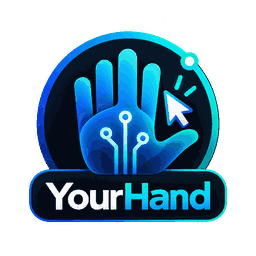

# YourHand — Media & Project Brief



**Your AI. Your Hand.**

YourHand is an open-source Windows device-control project exploring how authorized AI clients can work across multiple real Windows PCs through a permission-aware MCP architecture.

> **Community release status:** source preview, not a production-ready installer. The public repository is a separately reviewed community source snapshot. The official hosted service and packaged Windows installer are separate deployments.

## Quick facts

- **Project:** YourHand
- **Creator / maintainer:** Ahmed Zaki
- **Community license:** GNU AGPL-3.0-only
- **Repository:** https://github.com/archahmedzaki/YourHand-Community
- **Hosted beta:** https://yourhand.wolvexai.com/
- **Beta pricing:** free during the current beta
- **Primary platform:** Windows
- **Protocol / integration:** MCP-compatible control layer
- **Media contact:** arch.ahmedzaki@gmail.com

## One-sentence description

YourHand connects supported AI clients to explicitly authorized Windows machines so one conversation can route work across multiple PCs without collapsing device ownership or permissions into a single shared desktop session.

## What makes the project technically interesting

The control path is designed as separate trust and execution layers:

```text
AI client
   ↓
MCP / plugin layer
   ↓
Control plane
   ↓
Capability router
   ↓
Windows agent
   ↓
OS / browser / UI / files / commands
```

The project is intentionally not built around screenshot-only automation. Depending on the task, an implementation can prefer direct OS/application APIs, browser control, semantic Windows UI Automation, and guarded fallback interaction.

The community source also documents account/device authorization, sharing boundaries, operation journaling, scoped usage telemetry, privacy controls, threat modeling, release criteria, and failure handling.

## Multi-device model

Devices are explicit account-scoped resources. A compatible client can target a named authorized machine rather than treating every connected computer as one implicit session. The design also separates device ownership from controlled sharing so access can be granted without requiring competing agents for the same Windows installation.

## Source available today

The public repository includes:

- MCP/Core server source
- account/device ownership and sharing logic
- Windows Agent source
- C# native Windows UI helper
- dashboard source
- action journaling and telemetry components
- synthetic privacy, security, execution, and regression tests
- architecture, threat-model, privacy, compatibility, governance, contribution, CLA, and release documentation

For exact verified and unverified functionality, see [Project Status](docs/PROJECT_STATUS.md).

## Safety and trust boundaries

YourHand's community documentation emphasizes:

- explicit device authorization
- account separation
- human oversight for consequential external actions
- no bypass of protected Windows desktops or credentials
- outcome-aware handling of timed-out state-changing actions
- privacy controls for screenshots, files, credentials, tool inputs, logs, and device data

See [Threat Model](docs/THREAT_MODEL.md), [Privacy and Data](docs/PRIVACY_AND_DATA.md), and [Security](SECURITY.md).

## Images

- [YourHand 256×256 logo](web/YourHand_256.png)
- [YourHand web artwork](web/YourHand_Web.png)

## Technical reading

- [README](README.md)
- [Architecture](docs/ARCHITECTURE.md)
- [Project Status](docs/PROJECT_STATUS.md)
- [MCP and Device Access](docs/MCP_AND_DEVICES.md)
- [Threat Model](docs/THREAT_MODEL.md)
- [Roadmap](docs/ROADMAP.md)
- [Community E2E Lab Report](docs/COMMUNITY_LAB_E2E_REPORT.md)

External technical write-ups:

- DEV Community: https://dev.to/archahmedzak/i-built-an-open-source-bridge-that-lets-one-ai-chat-work-across-multiple-windows-pcs-1m5l
- Hashnode: https://yourhand.hashnode.dev/how-i-built-an-open-source-bridge-between-ai-chats-and-multiple-windows-pcs

## Interview / demo topics

Useful technical angles include:

- why multi-PC agent control is different from single-session desktop automation
- capability routing versus screenshot-only control
- permission boundaries between AI clients, the control plane, and Windows agents
- observability and outcome uncertainty in desktop automation
- account-scoped device sharing
- recovery and reliability across real Windows sessions
- open-source governance and the boundary between community source and a separately hosted service

## Accuracy note

Please do not describe the community repository as a production-ready packaged installer. The repository deliberately identifies missing binaries, unverified flows, and release blockers. Compatible-client availability and marketplace approval are separate from source availability.

---

Developed by **Ahmed Zaki** and the YourHand contributors. YourHand is not affiliated with or endorsed by OpenAI, Microsoft, or Google.
