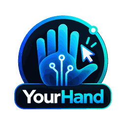

<div align="center">



# YourHand

**Your AI. Your Hand.**

**Open-source Windows device control through a permission-aware MCP server.**

[](LICENSE)
[](.github/workflows/ci.yml)
[](https://m8ven.ai/mcp/archahmedzaki/yourhand-community)
[](docs/PROJECT_STATUS.md)

[Overview](#overview) · [Get started](#get-started) · [Documentation](#documentation) · [Roadmap](docs/ROADMAP.md) · [Contributing](CONTRIBUTING.md) · [Security](SECURITY.md)

</div>

> **Release status: source preview, not a production-ready installer.** This repository publishes a separately reviewed community source snapshot. The official hosted YourHand service and its Windows installer are separate deployments. Do not deploy this checkout over an existing installation or connect it to a production customer database. See [what works and what remains](docs/PROJECT_STATUS.md).

## Overview

YourHand connects an authorized Windows computer to an account-scoped control plane that exposes MCP tools to compatible clients. The goal is to let people work with their own machines through natural-language assistants **without handing control of one user's devices to another**.

The community source includes a web dashboard, account/device ownership and sharing logic, an MCP/HTTP Core, a Windows Agent, a C# native UI helper, operation journaling, scoped usage telemetry, and isolated regression tests. The [architecture](docs/ARCHITECTURE.md) explains each component and its trust boundary. Source availability does **not** imply that every listed tool, device feature, installer, or marketplace listing has passed an end-to-end production test.

### Who this is for

Developers exploring agentic computer interaction, Windows automation maintainers, MCP integrators, and organizations testing authorized device-control workflows on **disposable, non-production machines**.

### Design principles

- **Your device, your authorization:** pairing and sharing are per account; actions must be limited to explicitly authorized devices.
- **Human oversight:** operations that may change external state need appropriate control. Protected Windows desktops and credentials must not be bypassed.
- **Reliable outcomes:** a timed-out state-changing action is *outcome unknown*, not permission to repeat it blindly.
- **Privacy by default:** do not collect or publish customer files, credentials, screenshots, raw tool inputs or private session details.
- **Open source, honest status:** source code, tests and documented limitations are public; missing binaries and unverified flows are identified rather than hidden.

## What is included?

| Component | Location | Purpose |
|---|---|---|
| Core & MCP server | `server-multiuser.js`, `src/multiuser/` | Authentication, account/device checks, RPC, operation and usage records |
| Windows Agent | `yourhand-agent.mjs`, `yh-action-journal.mjs` | Authorized agent-side control and action status |
| Native UI helper | `native/YourHandNative.cs`, `native/build.ps1` | Desktop observation and guarded Windows UI interaction |
| Windows device manager source | `YourHandManager.cs` | Local Windows manager source; **no ready-to-install executable is shipped** |
| Dashboard | `web/` | Account-scoped devices, pairing and usage interface |
| Tests | `tests/` | Synthetic security, privacy, execution and regression checks |

## Get started

**Prerequisites:** Windows for native helper integration; Node.js **24+** and npm; a local development-only directory; .NET Framework C# build tools for the optional native helper. Any OAuth-enabled web demo requires your **own** Google OAuth configuration.

```powershell
git clone https://github.com/archahmedzaki/YourHand-Community.git
cd YourHand-Community
npm ci
npm test
npm run test:privacy
```

For a **local lab only**, copy `.env.example` to an untracked `.env`, review each option, then run `npm start`. The server binds its development ports to loopback; this is not a secure internet deployment by itself. A working sign-in, public HTTPS origin, remote device enrollment and packaged Windows installation **are not automatically provisioned** by these commands. Read the [development setup](docs/DEVELOPMENT_SETUP.md), [configuration](docs/CONFIGURATION.md) and [known limitations](docs/PROJECT_STATUS.md) before proceeding.

## Documentation

| Guide | Contents |
|---|---|
| [Project status](docs/PROJECT_STATUS.md) | Implemented source, verified tests, release blockers |
| [Isolated Community E2E lab](docs/COMMUNITY_LAB_E2E_REPORT.md) | Source-to-Agent pairing and read-only command test, exact remaining installer blockers |
| [CLA legal review](docs/CLA_COUNSEL_REVIEW.md) | Individual/corporate rights-holder drafts, legal questions and signing safeguards |
| [Development setup](docs/DEVELOPMENT_SETUP.md) | Local-only setup, source build, testing and cleanup |
| [Architecture](docs/ARCHITECTURE.md) | Components, identity, flow and deployment boundaries |
| [Configuration](docs/CONFIGURATION.md) | Environment variables and secrets handling |
| [MCP and device access](docs/MCP_AND_DEVICES.md) | Tool groups, authorization, safety and availability |
| [Threat model](docs/THREAT_MODEL.md) | Assets, trust boundaries, mitigations and risks |
| [Privacy and data](docs/PRIVACY_AND_DATA.md) | What operators must protect and disclose |
| [Compatibility](docs/COMPATIBILITY.md) | Supported source targets and unavailable packaged features |
| [FAQ](docs/FAQ.md) | Licensing, app-store, installer and donation questions |
| [Automation and CI](docs/AUTOMATION_AND_CI.md) | Active [GitHub Actions checks](.github/workflows/ci.yml), native GitHub secret protection and maintainer review |
| [Release process](docs/RELEASING.md) | Source and binary release acceptance criteria |
| [Troubleshooting](docs/TROUBLESHOOTING.md) | Common local development failures |
| [Roadmap](docs/ROADMAP.md) | Publicly tracked directions, without delivery promises |
| [Governance](GOVERNANCE.md) | Maintainer decisions, review and releases |
| [Contributing](CONTRIBUTING.md) | Bug reports, development guidelines, CLA intake status |
| [Security](SECURITY.md) | Private vulnerability reporting and disclosure |
| [Support](SUPPORT.md) | Community help and optional donations |

## Open source and commercial use

The community source is distributed under **GNU AGPL-3.0-only**; see [LICENSE](LICENSE). Its copyright license permits commercial use under its terms. The official hosted service is a separate offering. Any distinct proprietary edition may use only source for which the maintainer holds appropriate independent licensing rights.

**Contributors retain ownership.** The maintainer has adopted an [individual non-exclusive CLA v1.1](CONTRIBUTOR_LICENSE_AGREEMENT.md) expressly covering AGPL and separately licensed commercial/proprietary use of original contributions, and published its [versioned signing text](https://gist.github.com/archahmedzaki/e2b383e438726b5b157bd5451c0171ba). **Repository-scoped CLA consent automation is active and required on `main`**: an [unsigned PR failed as expected](https://github.com/archahmedzaki/YourHand-Community/pull/10). The hosted app's account-wide OAuth was declined; the [narrow-permission PR-comment signing procedure](docs/CLA_SCOPED_SIGNING.md) does not access the original private repo. A real signed-contributor PR test and rights-holder review remain required before outside code is merged. A company-owned contribution also requires authorized rights-holder permission. The CLA was not independently certified by a lawyer. See [signing activation](docs/CLA_SIGNING_SETUP.md) and [licensing policy](docs/LICENSING_POLICY.md).

## Community and safety

Please use [GitHub Issues](https://github.com/archahmedzaki/YourHand-Community/issues) for sanitized bug reports and discussions, following our [Code of Conduct](CODE_OF_CONDUCT.md). **Never post pairing tokens, device identifiers, API keys, customer screenshots, databases or service logs.** Security problems should follow [private reporting instructions](SECURITY.md), not public issues.

If you would like to support ongoing development, see [SUPPORT.md](SUPPORT.md). Donations are optional; there is **no active PayPal link in this repository yet**, and donating does not purchase access or support privileges.

---

<sub>Developed by Ahmed Zaki and the YourHand contributors. YourHand is not affiliated with or endorsed by OpenAI, Microsoft or Google. Compatible client availability and official marketplace approval are separate matters.</sub>
